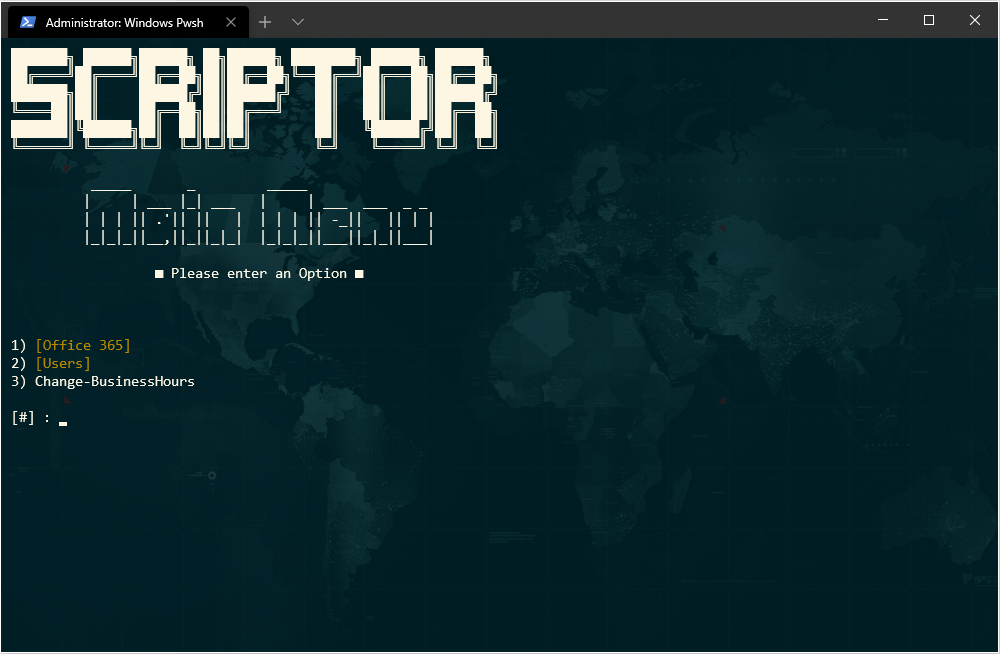

# FancyScriptor
### A PowerShell script organization / execution tool

FancyScriptor allows you to organize your PowerShell scrips into a Windows folder structure with folders becoming sub-menus and the scripts in those folders becoming menu items.

FancyScriptor also allows you to pass parameters to your scripts.

-----------------------------------------------------------------------------

To get started, download the source files and organize your scripts under the `'\scripts\'` directory.

FancyScriptor will execute PowerShell Script (`.ps1`) files as they are.  For the additional functionality of passing parameters, the script must be converted to a PowerShell Script Module (`.psm1`) with an '`Invoke-Main`' function which encapsulates the script content.

To pass parameters:
1.  Define the parameters in the '`Invoke-Main`' function of your PowerShell Script Module file
1.  Edit the `.\FancyScriptor.ps1` file:
    1.  Add a *case* to the *switch* statement, starting at `line 194`. The name of the *case* must match the name of a parameter in the  '`Invoke-Main`' function of the PowerShell Script Module. The value assigned in the line following must end in the name of a variable defined in the section starting at `line 292`. This is also where the variable is given a value.

PowerShell Script Modules can be placed in the `'\scripts\#modules\'` folder in order to hide them from the FancyScriptor user interface if they are not designed to be executed by the user.

-----------------------------------------------------------------------------
(screenshot of FancyScriptor running in a customized Windows Terminal instance)

